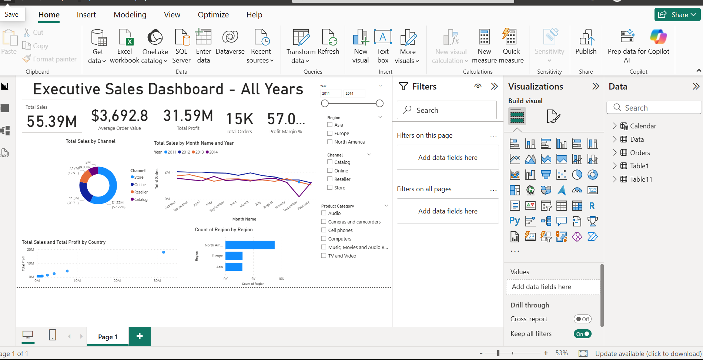

# 📊 Sales Dashboard (Power BI)

## 📌 Project Overview
This interactive Power BI Sales Dashboard provides insights into sales performance, profitability, and order trends. It helps business users monitor KPIs and make data-driven decisions.

---

## 🎯 Objective
To analyze sales data and identify trends, high-performing regions, products, and profit opportunities.

---

## 🛠 Tools Used
- Power BI
- Power Query
- DAX
- Microsoft Excel

---

## 📈 Key KPIs
- Total Sales
- Total Profit
- Total Orders
- Profit Margin

---

## 📊 Dashboard Features
- KPI Cards
- Sales Trend Analysis
- Category-wise Sales
- Region-wise Performance
- Profit Analysis
- Interactive Filters (Slicers)

---

## 💡 Business Insights
- Identified top-performing product categories.
- Compared regional sales performance.
- Analyzed monthly sales trends.
- Highlighted profit-driving products.

---

## 📂 Files Included
- `DB1(Sales_DB).pbix`
- `Orders.xlsx`
- Dashboard Screenshot

---

## 📷 Dashboard Preview

---

## 🚀 Skills Demonstrated
- Data Cleaning
- Data Modeling
- DAX Measures
- Power Query
- Dashboard Design
- Data Visualization
- Business Analysis
